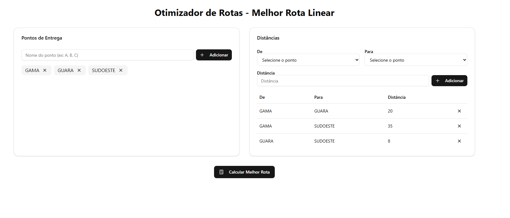
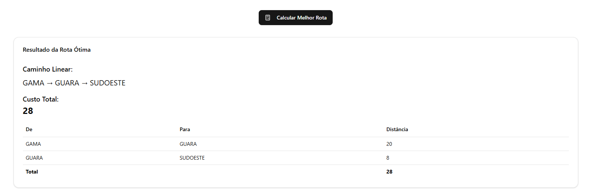

# Grafos 2 - Melhor Rota
 
**Conteúdo da Disciplina**: FGA0124 - PROJETO DE ALGORITMOS - T01  


## Alunos


<div align = "center">
<table>
  <tr>
    <td align="center"><a href="https://github.com/ArtAssLou"><br /><sub><b>Arthur D'Assumpção</b></sub></a><br /><a href="Link git" title="Rocketseat"></a></td>
    <td align="center"><a href="https://github.com/EmersonTeles"><br /><sub><b>Emerson Luis Teles dos Santos </b></sub></a><br />
  </tr>
</table>

| Matrícula   | Aluno                             |
| ----------- | ---------------------------------- |
| 190084570  | Arthur D'Assumpção Loureiro           |
| 200017322  | Emerson Luis Teles dos Santos     |
</div>

## Sobre 
O "Melhor Rota" é um sistema simples que usa o algoritmo de Kruskal para encontrar a melhor rota entre vários pontos. Você insere os pontos e as distâncias entre eles, e o sistema calcula a rota mais econômica que conecta todos os pontos, destacando os caminhos escolhidos. É uma forma prática de entender como o algoritmo de Kruskal funciona na otimização de rotas, sem complicações. Pode ser usado por uma transportadora antes de escolher uma rota de entrega.

## Screenshots

Imagem 1: Tela inicial
 

Imagem 2: Campos preenchidos


Imagem 3: Resultado



## Instalação 

**Para acessar em produção**: https://menorota.vercel.app/


**Linguagem**: HTML, CSS, JavaScrip

### Clone do Repositório:

```bash
git clone https://github.com/projeto-de-algoritmos-2025/grafos2_MelhorCaminho.git
```

### Entrar na Pasta: 
```bash
cd /projeto
```

### Instalar competencias: 
```bash
npm install
```

### Rodar:

```bash
npm run dev
```


## Uso 
O "Melhor Rota" ajuda transportadoras a definir a rota mais econômica entre diversos pontos de entrega. Basta inserir os locais de entrega e as distâncias entre eles, e o sistema usa o algoritmo de Kruskal para calcular a rota com o menor custo total, conectando todos os pontos sem repetir caminhos desnecessários. Isso é útil para reduzir custos com combustível, tempo de entrega e manutenção dos veículos, garantindo que todos os pontos sejam atendidos da forma mais eficiente possível


## Apresentação 

Botar Link aqui: https://unbbr.sharepoint.com/:v:/s/Gravaes851/ESm5azoWKmtOhmB8di7ArCABlar7LiduCgjAZ2FNcfBy0w?e=Uo8hdH&nav=eyJyZWZlcnJhbEluZm8iOnsicmVmZXJyYWxBcHAiOiJTdHJlYW1XZWJBcHAiLCJyZWZlcnJhbFZpZXciOiJTaGFyZURpYWxvZy1MaW5rIiwicmVmZXJyYWxBcHBQbGF0Zm9ybSI6IldlYiIsInJlZmVycmFsTW9kZSI6InZpZXcifX0%3D

<font size="3"><p style="text-align: center">Autor: [Arthur D'Assumpção](https://github.com/ArtAssLou) e [Emerson Teles](https://github.com/ArtAssLou).</p></font>


## Outros 
Trabalho usando algoritmo de Kruskal


